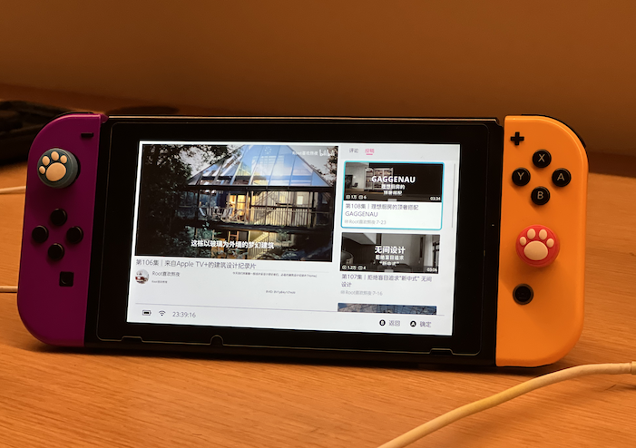

‼️：仅在最新 `大气层` + 最新 `固件` + `FAT32` 内存卡测试，其他组合出现的问题不进行处理。

 

# wiliwili

一个第三方 Nintendo Switch [B站](https://www.bilibili.com)客户端

wiliwlili 拥有非常接近官方PC客户端的B站浏览体验，  
同时支持触屏与手柄按键操控，  
让你的switch瞬间变身机顶盒与掌上平板。
 
 

# 支持特性

播放页：视频 番剧 影视 综艺  
个人页：扫码登录 历史记录 个人收藏  
搜索页：视频 番剧 影视  
直播页：不是十分稳定的支持 (也可以说是十分不稳定)  
首页推荐：完美复制原版pc端布局  

 

# 安装流程

1. 将wiliwli.nro放置在内存卡路径： switch/wiliwili.nro 
2. 在主页 `按住` R键打开任意游戏进入HBMenu，在列表中选择wiliwili点击打开即可。
3. [可选] 提供了NSP Forwarder （桌面图标）使用说明见下载压缩包内

⚠️：不要在相册内打开wiliwili，会导致内存不足系统重启。

 

# TODO list

- [x] 初步完成底层基础组件、首页各类推荐视频、用户视频播放页
- [x] 微调页面、解决播放器启动速度慢、解决播放页面退出卡顿
- [x] 临时解决异步加载导致的空指针问题（图片异步加载某些情况还会出现问题，待修复）
- [x] 添加番剧/影视播放、添加扫码登录、播放历史、用户收藏夹（收藏夹相关部分工作不稳定）
- [x] 初步添加搜索
- [x] 播放页新增分集与UP主最新投稿
- [ ] 完善视频播放页用户评论内容
- [ ] 重构图片异步加载逻辑
- [ ] 解决收藏夹、搜索页某些情况导致闪退的问题
- [ ] 完善搜索页：番剧、影视 转为竖图
- [x] 完善播放页投稿列表：调整结构、自动加载下一页
- [ ] 播放页展示合集与推荐

 

# 反馈问题前要做的事

仅在最新 `大气层` + 最新 `固件` + `FAT32` 内存卡测试，其他组合出现的问题不进行处理。

1. 首先确保 `大气层`、`固件`、`内存卡` 三者符合要求
2. 确保switch系统时间正常，如果进入应用弹出 `网络错误` 一般是由这个问题导致的。
3. 完整且详细地描述你的问题，最好附加演示视频、截图
4. 尝试复现问题，尽力找到BUG出现的规律

 

# 应用截图

# Reference

https://devkitpro.org/wiki/devkitPro_pacman

https://github.com/devkitPro/pacman/releases

https://github.com/devkitPro/pacman-packages

https://github.com/natinusala/borealis

https://github.com/Cpasjuste/pplay

https://github.com/whoshuu/cpr

https://github.com/nlohmann/json

https://github.com/nayuki/QR-Code-generator

https://github.com/progschj/ThreadPool
