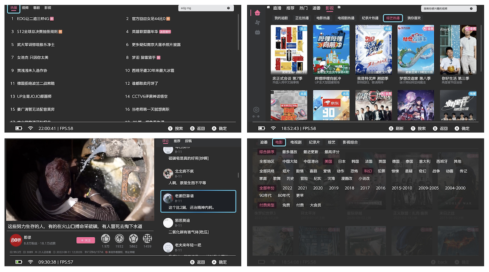

# wiliwili

一个专为手柄用户设计的 [B站](https://www.bilibili.com)客户端


wiliwili 拥有非常接近官方PC客户端的B站浏览体验，  
同时支持**触屏**与**手柄**操控，  
让你的switch瞬间变身机顶盒与掌上平板。
<br>

[](https://github.com/xfangfang/wiliwili/releases)       

<br>

# 支持特性

多语言：简体、繁体（自动翻译）、英语  
主题色：支持根据主题自动切换深浅主题  
播放页：视频 番剧 影视 综艺，同时支持弹幕  
个人页：扫码登录 历史记录 个人收藏  
搜索页：热搜 视频 番剧 影视  
动态页：关注的UP主最近更新的视频  
直播页：支持观看关注的主播与其他系统推荐  
分类检索：快速找到想看的电影和番剧  
首页推荐：完美复制原版pc端布局

<br>

# 安装流程 (Nintendo Switch)

0. 下载安装包：[wiliwili releases](https://github.com/xfangfang/wiliwili/releases)
1. 将 wiliwili.nro 放置在内存卡路径： switch/wiliwili.nro
2. 在主页 `按住` R键打开任意游戏进入 hbmenu，在列表中选择 wiliwili 点击打开即可。
3. [可选] 在应用内安装桌面图标，入口：设置/实用工具/使用教程

<br>

# TODO list

<p>
<details>
<summary id="todo">点击展开</summary>

- [x] 初步完成底层基础组件、首页各类推荐视频、用户视频播放页
- [x] 微调页面、解决播放器启动速度慢、解决播放页面退出卡顿
- [x] 临时解决异步加载导致的空指针问题（图片异步加载某些情况还会出现问题，待修复）
- [x] 添加番剧/影视播放、添加扫码登录、播放历史、用户收藏夹（收藏夹相关部分工作不稳定）
- [x] 初步添加搜索
- [x] 播放页新增分集与UP主最新投稿
- [ ] 完善视频播放页用户评论内容
- [ ] 重构图片异步加载逻辑
- [x] 解决收藏夹、搜索页某些情况导致闪退的问题
- [x] 完善搜索页：番剧、影视 转为竖图
- [x] 完善播放页投稿列表：调整结构、自动加载下一页
- [ ] 播放页展示合集与推荐
- [x] 添加动态页
- [x] 添加视频检索页
- [x] 完善设置页
- [ ] 弹幕相关设置
- [ ] 点赞、投币、收藏
- [ ] 拖拽调节进度、长按快速调节进度
- [ ] 增加单手模式使用一个手柄来控制播放器
- [ ] 安装图标时检查wiliwili位置
- [ ] NSP forwarder自动检查多个位置的nro文件，避免无法打开
- [ ] 增加设置使首页无法通过返回退出，避免误触
- [ ] 使用教程添加未指明的快捷键说明
- [ ] 重压摇杆临时快进
- [ ] 增加平板模式与电视模式页面样式的切换

</details>
</p>

<br>

# 反馈问题前要做的事

仅在 `最新大气层` + `最新固件` + `FAT32` 内存卡测试。

1. 首先确保 `大气层`、`固件`、`内存卡` 三者符合要求
2. 确保switch系统时间正常，如果进入应用弹出 `网络错误` 一般是由这个问题导致的。
3. 重置switch系统网络设置，尤其是DNS配置，某些DNS服务器无法正确解析API域名和视频地址
4. `完整且详细地` 描述你的问题，最好附加演示视频、截图。
5. 网络相关的问题附加 `网络诊断截图`，入口：应用内设置/实用工具/网络诊断
6. 尝试复现问题，尽力找到BUG出现的规律

<br>

# 贡献

本应用基于 nanovg 绘制界面，nanovg底层可移植切换到任意图形库，视频播放部分则使用MPV+FFMPEG 通过OpenGL绘制。
所以按照我的理解 wiliwili 应该可以移植到任何一个内存大于500MB，支持OpenGL（ES）的设备。

目前我正在处理mpv在switch上播放部分视频报错的问题，也欢迎了解 FFMPEG、MPV或命令行GDB调试的朋友与我联系共同研究。

<br>

# 开发

```shell
# 拉取代码
git clone --recursive https://github.com/xfangfang/wiliwili.git
cd wiliwili
```

### PC本地运行

目前 wiliwili 支持运行在 Linux macOS 和 Windows上

可以从 [Github-Actions](https://github.com/xfangfang/wiliwili/actions/workflows/build.yaml) 下载自动构建的测试版客户端

<p>
<details>
<summary id="local-pc">点击展开</summary>

构建出来的客户端某些图标缺失，请参考：https://github.com/xfangfang/wiliwili/issues/13#issuecomment-1296299063

#### macOS

```shell
# macOS: install dependencies
brew install glfw3 glm mpv

cmake -B build -DPLATFORM_DESKTOP=ON
make -C build wiliwili -j$(nproc)
```

#### Linux

```shell
# Ubuntu: install dependencies (glfw3.3 or later)
sudo apt install libcurl4-openssl-dev libglfw3-dev libglm-dev libmpv-dev

cmake -B build -DPLATFORM_DESKTOP=ON
make -C build wiliwili -j$(nproc)
```

#### Windows

```shell
# Windows: install dependencies (MSYS2 MinGW64)
pacman -S mingw-w64-x86_64-gcc mingw-w64-x86_64-cmake mingw-w64-x86_64-make \
  git mingw-w64-x86_64-glfw mingw-w64-x86_64-glm mingw-w64-x86_64-mpv

cmake -B build -G "MinGW Makefiles" -DPLATFORM_DESKTOP=ON ..
mingw32-make -C build wiliwili -j$(nproc)
```

</details>
</p>

### 交叉编译 Switch 可执行文件 (wiliwili.nro)

推荐使用docker构建，本地构建配置环境略微繁琐不过可用来切换底层的ffmpeg或mpv等其他依赖库更灵活地进行调试。

<p>
<details>
<summary id="local-switch">点击展开</summary>

#### Docker

```shell
docker run --rm -v $(pwd):/data devkitpro/devkita64:20221113 \
  sh -c "/data/scripts/build_switch.sh"
```

#### 本地编译

```shell
# 1. 安装devkitpro环境: https://github.com/devkitPro/pacman/releases

# 2. 安装预编译的依赖
sudo dkp-pacman -S switch-glfw switch-glm switch-cmake devkita64-cmake switch-pkg-config

# 3. 安装ffmpeg与mpv（使用自编译的库，官方的库无法播放网络视频）
# 手动编译方法请看：scripts/README.md
sudo dkp-pacman -U \
  https://github.com/xfangfang/wiliwili/releases/download/v0.1.0/switch-ffmpeg-4.4.3-1-any.pkg.tar.xz \
  https://github.com/xfangfang/wiliwili/releases/download/v0.1.0/switch-libmpv-0.34.1-1-any.pkg.tar.xz

# 4. 可选：安装依赖库 mininsp：https://github.com/StarDustCFW/nspmini
# (1). 在resources 目录下放置：nsp_forwarder.nsp
# (2). cmake 构建参数添加 -DBUILTIN_NSP=ON
# 按上述配置后，从相册打开wiliwili时会增加一个安装NSP Forwarder的按钮

# 5. build
cmake -B cmake-build-switch
make -C cmake-build-switch wiliwili.nro -j$(nproc)
```

</details>
</p>

<br>

# 应用截图

<p align="center">


</p>

# Acknowledgement

- devkitpro and switchbrew
    - https://github.com/devkitPro/pacman/releases
    - https://github.com/devkitPro/pacman-packages
    - https://github.com/switchbrew/libnx
- natinusala and XITRIX
    - https://github.com/natinusala/borealis
    - https://github.com/XITRIX/borealis
- Cpasjuste and proconsule
    - https://github.com/Cpasjuste/pplay
    - https://github.com/proconsule/nxmp
- https://github.com/libcpr/cpr
- https://github.com/nlohmann/json
- https://github.com/nayuki/QR-Code-generator
- https://github.com/BYVoid/OpenCC
- https://github.com/progschj/ThreadPool
